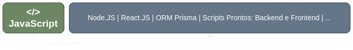

# QuickSnip [</>]

---

> QuickSnip é um repositório de snippets de código para desenvolvedores web. Organizado e constantemente atualizado, oferece trechos prontos de HTML, CSS, JavaScript, e outras tecnologias, otimizando o tempo de desenvolvimento. Copie, cole e acelere a criação dos seus projetos com soluções eficientes.

Estrutura com o conteúdo de **Frontend** englobado dentro de **React.JS**:

### Menu de Snippets QuickSnip

---

