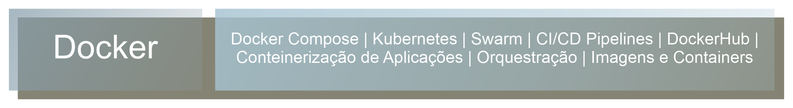

# QuickSnip

---

> **Sobre**
>
> > QuickSnip é um repositório de snippets de código para desenvolvedores web. Organizado e constantemente atualizado, oferece trechos prontos de HTML, CSS, JavaScript, e outras tecnologias, otimizando o tempo de desenvolvimento. Copie, cole e acelere a criação dos seus projetos com soluções eficientes.
>
> **Aprendizado**
>
> > Documentar e organizar o que você aprende é uma das melhores formas de consolidar conhecimento e se preparar para desafios futuros. :fire:

Estrutura com o conteúdo de **Frontend** englobado dentro de **React.JS**:

### 🏆 Badges

### Menu de Snippets QuickSnip

---

<!--  -->

<!-- Botões de navegação -->

<!-- /Botões de navegação -->

