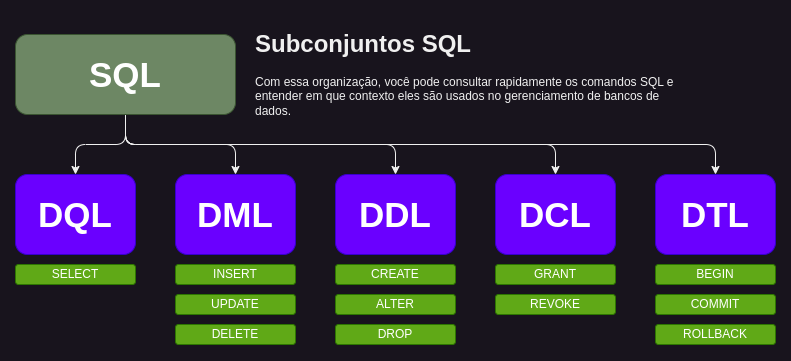

> ### QuickSnip

# Backend com Prisma e Node.js

---

<!-- Botões de navegação -->
[](../../README.md#quicksnip "Início")
[](../README.md#quicksnip "Voltar")
<!-- /Botões de navegação -->

## Conteúdo
1. **ORM Prisma**
   - **Instalação e Configuração**
     - Configuração inicial do Prisma
     - Definição do schema.prisma
     - Integração com bancos de dados (PostgreSQL, MySQL, etc.)
   - **Modelagem de Dados**
     - Definição de modelos no Prisma
     - Relacionamentos (1:1, 1:N, N:M)
     - Campos opcionais e padrões
   - **Consultas**
     - Consultas básicas (findUnique, findMany)
     - Filtragem, paginação e ordenação
     - Relações aninhadas
   - **Mutations**
     - Criação de registros (create)
     - Atualização de registros (update)
     - Exclusão de registros (delete)
   - **Migrations**
     - Gerar migrations a partir do schema
     - Aplicar migrations no banco de dados
     - Desfazer migrations
     - [Sincronizar Modelo do Banco de Dados](#sincronizar-modelo-do-banco-de-dados "Sincronizar Modelo do Banco de Dados")
     - [Gerar Tipos e Classes a Partir do Schema](#gerar-tipos-e-classes-a-partir-do-schema "Gerar Tipos e Classes a Partir do Schema")
   - **Manutenção de Dependências**
     - [Atualizar Dependências do Prisma](#1-atualizar-depend%C3%AAncias-do-prisma "Comandos para Atualizar e Corrigir Dependências do Prisma")
     - [Corrigir Vulnerabilidades de Segurança](#2-corrigir-vulnerabilidades-com-npm-audit-fix "Comandos para Atualizar e Corrigir Dependências do Prisma")
2. **Gerenciamento de Banco de Dados**
   - **Estrutura de Tabelas**
     - [Adicionar Colunas em Tabelas Existentes](#adicionar-uma-nova-coluna-como-chave-estrangeira "Adicionar Colunas em Tabelas Existentes")
     - [Transformar Colunas em Chaves Estrangeiras](#transformar-uma-coluna-existente-em-uma-chave-estrangeira "Transformar Colunas em Chaves Estrangeiras")
     - [Verificar Consistência de Dados](#verificar-consist%C3%AAncia-dos-dados-antes-de-criar-uma-fk "Verificar Consistência de Dados para Chaves Estrangeiras")
     - [Remover Chaves Estrangeiras](#remover-uma-chave-estrangeira "Remover Chaves Estrangeiras")
     - [Renomear Chaves Estrangeiras](#renomear-uma-chave-estrangeira "Renomear Chaves Estrangeiras")
     - [Resumo das Boas Práticas](#resumo-das-boas-pr%C3%A1ticas "Resumo das Boas Práticas para Chaves Estrangeiras")
   - **Linguagem SQL**
     - [Introdução ao SQL](#sql---linguagem-de-consulta-estruturada "Introdução ao SQL")
     - [DDL (Data Definition Language)](#1-ddl-data-definition-language---linguagem-de-defini%C3%A7%C3%A3o-de-dados "DDL (Data Definition Language)")
     - [DML (Data Manipulation Language)](#2-dml-data-manipulation-language---linguagem-de-manipula%C3%A7%C3%A3o-de-dados "DML (Data Manipulation Language)")
     - [DQL (Data Query Language)](#3-dql-data-query-language---linguagem-de-consulta-de-dados "DQL (Data Query Language)")
     - [DCL (Data Control Language)](#4-dcl-data-control-language---linguagem-de-controle-de-dados "DCL (Data Control Language)")
     - [DTL (Data Transaction Language)](#5-dtl-data-transaction-language---linguagem-de-transa%C3%A7%C3%A3o-de-dados "DTL (Data Transaction Language)")
3. **Testes e Depuração de APIs**
   - **Testando Endpoints com Insomnia**
     - [Executando um CRUD no Insomnia](#como-executar-um-crud-no-insomnia "Executando um CRUD no Insomnia")
     - [Configuração de Variáveis de Ambiente no Insomnia](#configura%C3%A7%C3%A3o-de-ambiente-no-insomnia "Configuração de Variáveis de Ambiente no Insomnia")

---

Todos os tópicos relacionados a **Frontend** estão organizados dentro de **React.JS**, facilitando o acesso ao conteúdo específico de React.

<!-- Botões de navegação -->
[](../../README.md#quicksnip "Início")
[](../README.md#quicksnip "Voltar")
[](#quicksnip "Topo")
[](#conteúdo "Conteúdo")
<!-- /Botões de navegação -->

---

## Comandos do Prisma para Sincronização e Geração de Tipos

### Sincronizar Modelo do Banco de Dados
Use o comando abaixo para sincronizar o modelo do Prisma com o estado atual do banco de dados. Isso é útil quando há mudanças diretas no banco de dados e você quer refletir essas alterações no esquema do Prisma.

```bash
npx prisma db pull
```

Esse comando atualiza o arquivo `schema.prisma` com as definições mais recentes de tabelas e colunas do banco de dados.

### Gerar Tipos e Classes a Partir do Schema
Após qualquer modificação no arquivo `schema.prisma`, execute o comando a seguir para gerar os tipos e as classes necessárias para o uso com o Prisma Client:

```bash
npx prisma generate
```

Esse comando cria automaticamente o cliente Prisma, facilitando o acesso aos modelos e consultas ao banco de dados dentro do seu código JavaScript ou TypeScript.

<!-- Botões de navegação -->
[](../../README.md#quicksnip "Início")
[](../README.md#quicksnip "Voltar")
[](#quicksnip "Topo")
[](#conteúdo "Conteúdo")
<!-- /Botões de navegação -->

---

## Comandos para Atualizar e Corrigir Dependências do Prisma

### 1. Atualizar Dependências do Prisma

Este comando atualiza as dependências `@prisma/client` e `prisma` para a versão mais recente no seu projeto. É útil para garantir que você esteja utilizando as últimas correções de bugs e melhorias.

```bash
npm update @prisma/client prisma
```

### 2. Corrigir Vulnerabilidades com `npm audit fix`

O comando abaixo executa uma verificação de vulnerabilidades de segurança e tenta corrigir automaticamente problemas nas dependências do projeto.

```bash
npm audit fix
```

### Observação
Sempre verifique o impacto de cada atualização no seu projeto, especialmente ao corrigir vulnerabilidades, pois algumas atualizações podem ser incompatíveis com versões específicas de bibliotecas que você utiliza.

Essas anotações podem ser úteis para manter as dependências de seus projetos em dia e mais seguras.

<!-- Botões de navegação -->
[](../../README.md#quicksnip "Início")
[](../README.md#quicksnip "Voltar")
[](#quicksnip "Topo")
[](#conteúdo "Conteúdo")
<!-- /Botões de navegação -->

---

## Gerenciando Chaves Estrangeiras no Banco de Dados

Aqui está um guia genérico sobre como adicionar ou ajustar colunas e configurar chaves estrangeiras em tabelas existentes no banco de dados. Este documento pode ser usado para referência futura.

### **Adicionar uma nova coluna como chave estrangeira**

Se você precisar adicionar uma nova coluna a uma tabela e configurá-la como uma chave estrangeira, use o seguinte exemplo genérico:

```sql
ALTER TABLE <nome_da_tabela>
ADD COLUMN <nome_da_coluna> <tipo_de_dado> AFTER <coluna_anterior>,
ADD CONSTRAINT <nome_da_fk> FOREIGN KEY (<nome_da_coluna>) REFERENCES <tabela_referenciada>(<coluna_referenciada>);
```

#### Exemplo
Adicionar a coluna `cliente_id` na tabela `pedidos` que referencie o campo `id` da tabela `clientes`:
```sql
ALTER TABLE pedidos
ADD COLUMN cliente_id INT AFTER data_pedido,
ADD CONSTRAINT fk_cliente_id FOREIGN KEY (cliente_id) REFERENCES clientes(id);
```

### **Transformar uma coluna existente em uma chave estrangeira**

Se a coluna já existir na tabela e você quiser configurá-la como chave estrangeira, use o seguinte exemplo:

```sql
ALTER TABLE <nome_da_tabela>
ADD CONSTRAINT <nome_da_fk> FOREIGN KEY (<nome_da_coluna>) REFERENCES <tabela_referenciada>(<coluna_referenciada>);
```

#### Exemplo
Configurar a coluna `produto_id` na tabela `vendas` como chave estrangeira referenciando a coluna `id` da tabela `produtos`:
```sql
ALTER TABLE vendas
ADD CONSTRAINT fk_produto_id FOREIGN KEY (produto_id) REFERENCES produtos(id);
```

### **Verificar consistência dos dados antes de criar uma FK**

Antes de adicionar uma restrição de chave estrangeira, é importante verificar se os valores existentes são válidos. Use o seguinte comando para verificar inconsistências:

```sql
SELECT <nome_da_coluna>
FROM <nome_da_tabela>
WHERE <nome_da_coluna> IS NOT NULL 
  AND <nome_da_coluna> NOT IN (SELECT <coluna_referenciada> FROM <tabela_referenciada>);
```

#### Exemplo
Verificar se os valores em `cliente_id` da tabela `pedidos` correspondem aos valores da tabela `clientes`:
```sql
SELECT cliente_id
FROM pedidos
WHERE cliente_id IS NOT NULL 
  AND cliente_id NOT IN (SELECT id FROM clientes);
```

### **Remover uma chave estrangeira**

Caso precise remover uma chave estrangeira, use o comando abaixo:

```sql
ALTER TABLE <nome_da_tabela>
DROP FOREIGN KEY <nome_da_fk>;
```

#### Exemplo
Remover a FK `fk_cliente_id` da tabela `pedidos`:
```sql
ALTER TABLE pedidos
DROP FOREIGN KEY fk_cliente_id;
```

### **Renomear uma chave estrangeira**

Para renomear uma FK, você precisará primeiro removê-la e depois recriá-la com o novo nome. Por exemplo:

#### Etapas:
1. Remover a FK existente:
   ```sql
   ALTER TABLE <nome_da_tabela>
   DROP FOREIGN KEY <nome_da_fk_antiga>;
   ```

2. Criar a FK com o novo nome:
   ```sql
   ALTER TABLE <nome_da_tabela>
   ADD CONSTRAINT <novo_nome_da_fk> FOREIGN KEY (<nome_da_coluna>) REFERENCES <tabela_referenciada>(<coluna_referenciada>);
   ```

#### Exemplo
Renomear a FK `fk_cliente_id` na tabela `pedidos` para `fk_novo_cliente_id`:
```sql
ALTER TABLE pedidos
DROP FOREIGN KEY fk_cliente_id;

ALTER TABLE pedidos
ADD CONSTRAINT fk_novo_cliente_id FOREIGN KEY (cliente_id) REFERENCES clientes(id);
```

### **Resumo das Boas Práticas**
1. Sempre **verifique os dados existentes** antes de adicionar uma FK para evitar erros de consistência.
2. Nomeie as FKs com prefixos descritivos, como `fk_<tabela_coluna>`, para facilitar a identificação no futuro.
3. Mantenha backups regulares do banco de dados antes de executar comandos que alterem a estrutura.

<!-- Botões de navegação -->
[](../../README.md#quicksnip "Início")
[](../README.md#quicksnip "Voltar")
[](#quicksnip "Topo")
[](#conteúdo "Conteúdo")
<!-- /Botões de navegação -->

---

# SQL - Linguagem de Consulta Estruturada

A **SQL (Structured Query Language)** é uma linguagem padrão usada para gerenciar e manipular bancos de dados relacionais. Ela é dividida em categorias baseadas no tipo de operações realizadas. Abaixo estão os principais grupos e seus comandos mais comuns:



---

## **1. DDL (Data Definition Language - Linguagem de Definição de Dados)**

Os comandos DDL são usados para definir e modificar a estrutura de um banco de dados, como tabelas, índices e esquemas.  
### Comandos Principais:
- **CREATE**: Cria novos objetos no banco de dados, como tabelas, índices, ou esquemas.
  - Exemplo: `CREATE TABLE alunos (id INT, nome VARCHAR(50));`
- **DROP**: Remove objetos do banco de dados, como tabelas ou esquemas.
  - Exemplo: `DROP TABLE alunos;`
- **ALTER**: Modifica a estrutura de um objeto existente, como adicionar ou remover colunas de uma tabela.
  - Exemplo: `ALTER TABLE alunos ADD data_nascimento DATE;`

---

## **2. DML (Data Manipulation Language - Linguagem de Manipulação de Dados)**

Os comandos DML são usados para manipular os dados dentro das tabelas.  
### Comandos Principais:
- **INSERT**: Insere dados em uma tabela.
  - Exemplo: `INSERT INTO alunos (id, nome) VALUES (1, 'João');`
- **UPDATE**: Atualiza dados existentes em uma tabela.
  - Exemplo: `UPDATE alunos SET nome = 'Maria' WHERE id = 1;`
- **DELETE**: Remove dados de uma tabela.
  - Exemplo: `DELETE FROM alunos WHERE id = 1;`

---

## **3. DQL (Data Query Language - Linguagem de Consulta de Dados)**

DQL é responsável pelas consultas no banco de dados, ou seja, pela recuperação de dados.
### Comandos Principais:
- **SELECT**: Recupera dados de uma tabela.
  - Exemplo: `SELECT nome FROM alunos;`
- **FROM**: Especifica de qual tabela os dados serão recuperados.
  - Exemplo: `SELECT * FROM alunos;`
- **JOIN**: Combina dados de duas ou mais tabelas baseadas em uma relação entre elas.
  - Exemplo: `SELECT alunos.nome, cursos.nome FROM alunos JOIN cursos ON alunos.id_curso = cursos.id;`

---

## **4. DCL (Data Control Language - Linguagem de Controle de Dados)**

Os comandos DCL controlam o acesso e as permissões dentro do banco de dados.  
### Comandos Principais:
- **GRANT**: Concede permissões a usuários.
  - Exemplo: `GRANT SELECT ON alunos TO usuario1;`
- **REVOKE**: Remove permissões de usuários.
  - Exemplo: `REVOKE SELECT ON alunos FROM usuario1;`

---

## **5. DTL (Data Transaction Language - Linguagem de Transação de Dados)**

Os comandos DTL lidam com a gestão de transações no banco de dados, garantindo integridade e consistência.
### Comandos Principais:
- **COMMIT**: Confirma as alterações realizadas durante uma transação.
  - Exemplo: `COMMIT;`
- **SAVEPOINT**: Define um ponto de salvamento dentro de uma transação.
  - Exemplo: `SAVEPOINT ponto1;`
- **ROLLBACK**: Reverte as alterações até um ponto definido ou ao início da transação.
  - Exemplo: `ROLLBACK TO ponto1;`

---

### **Resumo Visual**
- **DDL**: CREATE, DROP, ALTER  
- **DML**: INSERT, UPDATE, DELETE  
- **DQL**: SELECT, FROM, JOIN  
- **DCL**: GRANT, REVOKE  
- **DTL**: COMMIT, SAVEPOINT, ROLLBACK  

---

Com essa organização, você pode consultar rapidamente os comandos SQL e entender em que contexto eles são usados no gerenciamento de bancos de dados.

<!-- Botões de navegação -->
[](../../README.md#quicksnip "Início")
[](../README.md#quicksnip "Voltar")
[](#quicksnip "Topo")
[](#conteúdo "Conteúdo")
<!-- /Botões de navegação -->

---

## Como Executar um CRUD no Insomnia

### Introdução
Este guia apresenta como configurar e testar um CRUD utilizando o **Insomnia**, ferramenta popular para testar APIs RESTful. As instruções estão separadas em etapas para criar, ler, atualizar e excluir registros em uma API.

---

### Configuração Inicial
1. **Abra o Insomnia** e crie um novo espaço de trabalho ou selecione um existente.
2. Configure o endpoint base da sua API, por exemplo: `http://localhost:3000/api`.
3. Certifique-se de que a API está rodando localmente ou em ambiente de desenvolvimento.

---

### Operações do CRUD

#### **1. Create (POST)**  
- **URL:** `/items`  
- **Método:** POST  
- **Body (JSON):**
```json
{
  "name": "Item Exemplo",
  "description": "Descrição do item exemplo"
}
```
- **Headers:**  
  - `Content-Type: application/json`  

Clique em **Send** para testar a criação do item.

---

#### **2. Read (GET)**  
**Lista completa de itens**:
- **URL:** `/items`  
- **Método:** GET  

Clique em **Send** para recuperar todos os itens.

**Item específico**:  
- **URL:** `/items/:id`  
  - Substitua `:id` pelo ID do item que deseja buscar.
- **Método:** GET  

Clique em **Send** para recuperar os detalhes do item.

---

#### **3. Update (PUT)**  
- **URL:** `/items/:id`  
  - Substitua `:id` pelo ID do item a ser atualizado.
- **Método:** PUT  
- **Body (JSON):**
```json
{
  "name": "Item Atualizado",
  "description": "Descrição atualizada do item"
}
```
- **Headers:**  
  - `Content-Type: application/json`  

Clique em **Send** para atualizar o item.

---

#### **4. Delete (DELETE)**  
- **URL:** `/items/:id`  
  - Substitua `:id` pelo ID do item a ser excluído.
- **Método:** DELETE  

Clique em **Send** para excluir o item.

---

### Configuração de Ambiente no Insomnia
1. Clique em **Manage Environments** no menu superior.
2. Adicione um novo ambiente com a estrutura:
```json
{
  "base_url": "http://localhost:3000/api"
}
```
3. Substitua os endpoints por variáveis dinâmicas, como:  
   - **Exemplo:** `{{ base_url }}/items`

---

### Dica Extra
- Utilize as abas **History** e **Collections** no Insomnia para organizar os testes.
- Documente os endpoints com descrições detalhadas para facilitar futuros testes.

---

Agora basta ilustrar cada uma dessas operações com imagens ou capturas de tela do Insomnia para complementar o exemplo!

<!-- Botões de navegação -->
[](../../README.md#quicksnip "Início")
[](../README.md#quicksnip "Voltar")
[](#quicksnip "Topo")
[](#conteúdo "Conteúdo")
<!-- /Botões de navegação -->

---
