> ### QuickSnip

# Frontend com React.JS

---

<!-- Botões de navegação -->
[](../../README.md#quicksnip "Início")
[](../README.md#quicksnip "Voltar")
<!-- /Botões de navegação -->

## Conteúdo
1. **⚛️ React.JS**
   - **📁 Estrutura Básica**
     - 🧱 Criação de componentes funcionais
     - ✨ JSX e renderização condicional
     - 📬 Props e estado (state)
   - **🪝 Hooks**
     - 🎛️ useState para gerenciamento de estado
       - [📘 Explicação detalhada sobre `useState` com exemplos práticos](#explica%C3%A7%C3%A3o-detalhada-sobre-usestate-com-exemplos-pr%C3%A1ticos "Explicação detalhada sobre `useState` com exemplos práticos")
       - [🧩 Estados complexos (objetos e arrays) com `useState`](#exemplo-1-contador-simples "Estados complexos (objetos e arrays) com `useState`")
       - [⚠️ Boas práticas e erros comuns ao usar `useState`](#atualizando-estado-com-fun%C3%A7%C3%B5es-de-atualiza%C3%A7%C3%A3o "Boas práticas e erros comuns ao usar `useState`")
     - ⏱️ useEffect para efeitos colaterais
       - [📘 Explicação detalhada sobre `useEffect` com exemplos práticos](#explica%C3%A7%C3%A3o-detalhada-sobre-useeffect-com-exemplos-pr%C3%A1ticos "Explicação detalhada sobre `useEffect` com exemplos práticos")
       - [🧹 Limpeza de efeitos e uso de dependências](#3-limpeza-de-efeitos "Limpeza de efeitos e uso de dependências")
       - [⚠️ Erros comuns e boas práticas com `useEffect`](#erros-comuns-com-useeffect "Erros comuns e boas práticas com `useEffect`")
     - 🌐 useContext para contexto global
       - [📘 Explicação detalhada sobre `useContext` com exemplos práticos](#o-usecontext-para-contexto-global "Explicação detalhada sobre `useContext` com exemplos práticos")
       - [🌍 Compartilhando dados globais com `useContext`](#exemplo-avan%C3%A7ado-compartilhando-tema-global "Compartilhando dados globais com `useContext`")
       - [🚫 Quando usar `useContext` e evitar prop drilling](#quando-usar-usecontext "Quando usar `useContext` e evitar prop drilling")
   - **🧩 Componentes Avançados**
     - 🎛️ Componentes controlados e não controlados
     - 🧷 Refs com useRef
     - 💤 Lazy loading e Suspense
   - **🧭 Roteamento**
     - 🔧 Configuração básica com React Router
     - 🔄 Roteamento dinâmico
     - 🧭 Redirecionamento e links
   - **🗂️ Gerenciamento de Estado**
     - 🔁 useReducer para estados complexos
     - 🧠 Context API
     - 🧬 Integração com Redux
   - **🎨 Estilos**
     - 🧵 CSS-in-JS com styled-components
     - 💃 Animações com Framer Motion
     - 🌬️ Tailwind CSS com React
     - [📚 Guia Completo de Flexbox CSS](#flexbox-css-guia-completo-elementos-e-exemplos "Guia Completo de Flexbox CSS")
       - [❓ O que é o Flexbox](#o-que-%C3%A9-o-flexbox "O que é o Flexbox")
       - [📌 Importante!](#importante "Importante!")
       - [👩‍🏫 Juliana Amoasei](#juliana-amoasei "Juliana Amoasei")
     - 📱 Modelo de CSS Responsivo
       - [📐 Modelo de CSS Responsivo com Media Queries](#modelo-de-css-responsivo-com-media-queries "Modelo de CSS Responsivo com Media Queries")
   - **✅ Boas Práticas**
     - 🚀 Otimização de performance com memo e useCallback
     - 🧪 Testes com React Testing Library
     - ♿ Acessibilidade em componentes React
     - [📦 Verificando a versão do React e React-DOM com npm list](#-verificando-a-vers%C3%A3o-do-react-e-react-dom-em-projetos-com-frontend-isolado "Verificando a versão do React e React-DOM com npm list")


---

Nesta sessão há varios itens de conteúdos referentes à React.JS.

<!-- Botões de navegação -->
[](../../README.md#quicksnip "Início")
[](../README.md#quicksnip "Voltar")
[](#quicksnip "Topo")
[](#conteúdo "Conteúdo")
<!-- /Botões de navegação -->

---

## Explicação detalhada sobre `useState` com exemplos práticos

O `useState` é um dos hooks mais usados no React, utilizado para adicionar e gerenciar estados em componentes funcionais. Com ele, é possível definir valores dinâmicos que, ao serem alterados, causam uma re-renderização do componente para refletir as mudanças na interface do usuário.

### Como o `useState` Funciona

O `useState` permite que você declare uma variável de estado e uma função para atualizá-la. Ele recebe um valor inicial para o estado e retorna um array com dois elementos:

1. **O valor do estado atual**: a variável que representa o estado.
2. **Uma função para atualizar o estado**: ao ser chamada, essa função define um novo valor para o estado, causando a re-renderização do componente com o novo valor.

### Sintaxe Básica

```javascript
const [state, setState] = useState(initialValue);
```

- `state` é o valor atual do estado.
- `setState` é a função usada para atualizar o valor de `state`.
- `initialValue` é o valor inicial do estado, que pode ser de qualquer tipo: número, string, objeto, array, etc.

### Exemplo 1: Contador Simples

Vamos começar com um exemplo básico: um contador que aumenta de 1 em 1 quando clicamos em um botão.

```javascript
import React, { useState } from 'react';

function Counter() {
    // Declarando uma variável de estado chamada "count" com valor inicial 0
    const [count, setCount] = useState(0);

    return (
        <div>
            <p>Contagem: {count}</p>
            <button onClick={() => setCount(count + 1)}>Incrementar</button>
        </div>
    );
}
```

Neste exemplo:

- `count` é a variável de estado que armazena o valor atual do contador.
- `setCount` é a função que atualiza o estado `count`.
- Toda vez que `setCount` é chamado com um novo valor, o componente `Counter` é re-renderizado com o novo valor de `count`.

### Exemplo 2: Manipulação de Strings

Aqui está um exemplo de como `useState` pode ser usado para gerenciar o estado de uma string, como o valor de um campo de entrada (input).

```javascript
import React, { useState } from 'react';

function NameInput() {
    const [name, setName] = useState('');

    const handleChange = (e) => {
        setName(e.target.value);
    };

    return (
        <div>
            <input type="text" value={name} onChange={handleChange} placeholder="Digite seu nome" />
            <p>Seu nome é: {name}</p>
        </div>
    );
}
```

Neste exemplo:

- `name` é a variável de estado que armazena o valor do campo de entrada.
- `setName` atualiza o valor de `name` sempre que o usuário digita algo no campo de entrada.
- O valor de `name` é exibido em tempo real.

### Exemplo 3: Estado com Objetos

Você também pode usar `useState` para gerenciar estados complexos, como objetos. Neste exemplo, vamos armazenar o estado de um formulário com várias entradas (nome e idade).

```javascript
import React, { useState } from 'react';

function UserProfile() {
    const [user, setUser] = useState({ name: '', age: '' });

    const handleNameChange = (e) => {
        setUser((prevUser) => ({
            ...prevUser,
            name: e.target.value
        }));
    };

    const handleAgeChange = (e) => {
        setUser((prevUser) => ({
            ...prevUser,
            age: e.target.value
        }));
    };

    return (
        <div>
            <input type="text" value={user.name} onChange={handleNameChange} placeholder="Nome" />
            <input type="number" value={user.age} onChange={handleAgeChange} placeholder="Idade" />
            <p>Nome: {user.name}, Idade: {user.age}</p>
        </div>
    );
}
```

Neste exemplo:

- `user` é um objeto contendo o nome e a idade.
- `setUser` atualiza o objeto `user`. Utilizamos o spread operator (`...prevUser`) para garantir que outras propriedades de `user` não sejam sobrescritas.
- Isso é útil para formulários onde queremos manter várias entradas em um único objeto de estado.

### Exemplo 4: Estado com Arrays

Também é comum usar o `useState` para gerenciar arrays. Vamos ver um exemplo onde adicionamos itens a uma lista:

```javascript
import React, { useState } from 'react';

function ItemList() {
    const [items, setItems] = useState([]);

    const addItem = () => {
        setItems([...items, `Item ${items.length + 1}`]);
    };

    return (
        <div>
            <button onClick={addItem}>Adicionar Item</button>
            <ul>
                {items.map((item, index) => (
                    <li key={index}>{item}</li>
                ))}
            </ul>
        </div>
    );
}
```

Neste exemplo:

- `items` é um array que armazena uma lista de strings.
- `setItems` atualiza o array `items`, adicionando um novo item a cada clique do botão.
- Utilizamos o spread operator (`...items`) para copiar o array atual e adicionar um novo item ao final.

### Atualizando Estado com Funções de Atualização

Se o novo valor do estado depende do valor anterior, é melhor passar uma função para o `setState` em vez de um valor direto. A função recebe o estado anterior como argumento, o que ajuda a evitar problemas quando o estado é atualizado de forma assíncrona.

```javascript
setCount((prevCount) => prevCount + 1);
```

Isso é especialmente útil em casos onde o estado pode mudar rapidamente, como em contadores ou atualizações consecutivas.

### Resumo do `useState`

1. **Declaração**: `useState` permite declarar uma variável de estado e uma função para atualizá-la.
2. **Atualização**: Toda vez que a função de atualização do estado é chamada, o componente é re-renderizado com o novo valor do estado.
3. **Estado Inicial**: `useState` aceita um valor inicial, que pode ser um valor direto ou o resultado de uma função.
4. **Complexidade de Estado**: `useState` pode ser usado para estados simples (como números e strings) ou complexos (como arrays e objetos).

### Considerações

- **Atualizações de Estado Assíncronas**: `useState` realiza atualizações de estado de forma assíncrona, o que significa que o valor do estado pode não ser atualizado imediatamente após chamar `setState`. Isso é importante para operações que dependem do valor atualizado.
  
- **Não Modificar o Estado Diretamente**: Sempre use a função de atualização (como `setCount`) em vez de modificar o valor do estado diretamente. Isso garante que o React consiga detectar as mudanças e renderizar o componente corretamente.

O `useState` é a base para gerenciar estados em componentes funcionais e permite que seus componentes sejam interativos e dinâmicos. Junto com outros hooks como `useEffect`, ele forma a base de desenvolvimento de componentes React modernos.

<!-- Botões de navegação -->
[](../../README.md#quicksnip "Início")
[](../README.md#quicksnip "Voltar")
[](#quicksnip "Topo")
[](#conteúdo "Conteúdo")
<!-- /Botões de navegação -->

---

## Explicação detalhada sobre `useEffect` com exemplos práticos

O `useEffect` é um dos hooks fundamentais no React. Ele permite que você realize efeitos colaterais em componentes funcionais, como executar código após a renderização, manipular o DOM, buscar dados de APIs, configurar um intervalo de tempo, e muito mais. Antes do `useEffect`, esses tipos de operações eram feitos dentro dos métodos de ciclo de vida em componentes de classe, como `componentDidMount`, `componentDidUpdate`, e `componentWillUnmount`.

### Como o `useEffect` Funciona

O `useEffect` é executado após o React terminar de renderizar o componente pela primeira vez e, opcionalmente, após cada atualização (re-renderização), dependendo das dependências passadas para ele. Ele recebe dois parâmetros:

1. **Uma função de efeito (callback)**: o código que você quer executar após a renderização.
2. **Um array de dependências** (opcional): lista de variáveis que, quando mudam, fazem o `useEffect` ser executado novamente. Se o array estiver vazio (`[]`), o `useEffect` será executado apenas uma vez após a primeira renderização.

### Sintaxe Básica

```javascript
useEffect(() => {
    // Código a ser executado após a renderização
    return () => {
        // Código de limpeza (opcional)
    };
}, [dependências]);
```

### Exemplos de Uso

#### 1. Executando um Efeito Apenas na Primeira Renderização

Para executar um efeito apenas uma vez, após a primeira renderização (como buscar dados de uma API), passe um array de dependências vazio (`[]`). Isso faz o `useEffect` funcionar como `componentDidMount` em um componente de classe.

```javascript
import React, { useEffect, useState } from 'react';

function FetchDataComponent() {
    const [data, setData] = useState(null);

    useEffect(() => {
        // Executa o código de busca de dados apenas uma vez
        fetch('https://api.example.com/data')
            .then((response) => response.json())
            .then((data) => setData(data));
    }, []); // Array vazio como dependência

    return (
        <div>
            <h1>Dados da API</h1>
            {data ? <pre>{JSON.stringify(data, null, 2)}</pre> : <p>Carregando...</p>}
        </div>
    );
}
```

#### 2. Executando um Efeito Quando Uma Dependência Muda

Quando você passa variáveis no array de dependências, o `useEffect` será executado novamente sempre que uma dessas variáveis mudar. Isso é útil para casos como atualizar dados com base em uma entrada do usuário.

```javascript
import React, { useState, useEffect } from 'react';

function SearchComponent() {
    const [query, setQuery] = useState('');
    const [results, setResults] = useState([]);

    useEffect(() => {
        if (query) {
            fetch(`https://api.example.com/search?q=${query}`)
                .then((response) => response.json())
                .then((data) => setResults(data.results));
        }
    }, [query]); // O efeito é executado sempre que `query` muda

    return (
        <div>
            <input
                type="text"
                value={query}
                onChange={(e) => setQuery(e.target.value)}
                placeholder="Buscar..."
            />
            <ul>
                {results.map((result) => (
                    <li key={result.id}>{result.name}</li>
                ))}
            </ul>
        </div>
    );
}
```

#### 3. Limpeza de Efeitos

Muitos efeitos precisam de uma "limpeza" quando o componente é desmontado ou quando o efeito é executado novamente (por exemplo, remover um event listener, cancelar uma requisição ou limpar um intervalo). Para isso, o `useEffect` permite retornar uma função de limpeza.

```javascript
import React, { useEffect, useState } from 'react';

function TimerComponent() {
    const [count, setCount] = useState(0);

    useEffect(() => {
        // Define um intervalo de tempo
        const interval = setInterval(() => {
            setCount((prevCount) => prevCount + 1);
        }, 1000);

        // Função de limpeza que limpa o intervalo quando o componente é desmontado
        return () => clearInterval(interval);
    }, []); // Array vazio para rodar apenas uma vez

    return <h1>Contador: {count}</h1>;
}
```

Neste exemplo, o intervalo será limpo quando o componente for desmontado, prevenindo possíveis erros e vazamento de memória.

#### 4. Efeito Sem Dependências (Executa em Toda Renderização)

Se você não passar um array de dependências, o `useEffect` será executado após cada renderização do componente. Essa prática deve ser evitada na maioria dos casos, pois pode causar loops infinitos e sobrecarregar a aplicação.

```javascript
useEffect(() => {
    console.log('Este efeito será executado em toda renderização');
});
```

Esse uso é raro e geralmente não é recomendado.

### Resumo das Dependências

- **Sem array de dependências**: o efeito executa em toda renderização.
- **Array vazio (`[]`)**: o efeito executa apenas na primeira renderização.
- **Com dependências**: o efeito executa na primeira renderização e toda vez que uma das dependências mudar.

### Erros Comuns com `useEffect`

1. **Loops Infinitos**: Se você não configurar o array de dependências corretamente, pode causar um loop infinito, pois o efeito continuará sendo executado indefinidamente.
   
2. **Esquecer a Função de Limpeza**: Para efeitos que adicionam listeners ou intervalos, esquecer de limpar pode levar a problemas de desempenho e bugs.

3. **Dependências não Declaráveis**: Às vezes, você precisa de variáveis ou funções dentro do `useEffect` que não podem ser declaradas diretamente no array de dependências. Nestes casos, é recomendável usar `useCallback` ou `useMemo` para garantir que as referências não mudem em cada renderização.

### Conclusão

O `useEffect` é um hook poderoso que permite realizar efeitos colaterais em componentes funcionais de maneira controlada e previsível. Dominar seu uso e entender a mecânica das dependências ajudará a construir componentes mais eficientes e sem bugs.

<!-- Botões de navegação -->
[](../../README.md#quicksnip "Início")
[](../README.md#quicksnip "Voltar")
[](#quicksnip "Topo")
[](#conteúdo "Conteúdo")
<!-- /Botões de navegação -->

---

## O `useContext` para contexto global

O `useContext` é um hook no React que permite acessar o valor de um contexto em qualquer lugar de um componente funcional, sem precisar "passar" props através de vários níveis de componentes. Isso é útil para compartilhar informações globais, como dados de autenticação, configurações de tema, ou preferências do usuário, entre diversos componentes sem a necessidade de prop drilling (passagem de props por múltiplos componentes intermediários).

### Como o `useContext` Funciona

Para entender como `useContext` funciona, primeiro precisamos entender o contexto (`Context`) no React. O contexto é criado usando a função `React.createContext`, que retorna um objeto contendo um `Provider` e um `Consumer`.

- **`Provider`**: O `Provider` é um componente que "fornece" o valor do contexto para os componentes filhos.
- **`Consumer`**: O `Consumer` é um componente que permite acessar o valor do contexto. Com o hook `useContext`, você pode acessar o valor diretamente, sem precisar usar o `Consumer`.

O `useContext` simplifica o acesso ao valor do contexto em componentes funcionais. Ele recebe o próprio contexto como argumento e retorna o valor atual do contexto fornecido pelo `Provider`.

### Sintaxe Básica

```javascript
const valor = useContext(MyContext);
```

- `MyContext` é o contexto criado com `React.createContext`.
- `valor` será o valor atual do contexto, que pode ser um número, string, objeto, função, etc.

### Exemplo Completo de Uso do `useContext`

#### Passo 1: Criar um Contexto

Primeiro, criamos um contexto que será usado para armazenar o estado global. Neste exemplo, vamos criar um contexto para dados de autenticação.

```javascript
import React, { createContext, useState } from 'react';

// Criação do contexto de autenticação
export const AuthContext = createContext();

// Componente Provider que fornecerá o contexto
export function AuthProvider({ children }) {
    const [user, setUser] = useState(null);

    const login = (userData) => {
        setUser(userData); // Simula o login do usuário
    };

    const logout = () => {
        setUser(null); // Simula o logout do usuário
    };

    return (
        <AuthContext.Provider value={{ user, login, logout }}>
            {children}
        </AuthContext.Provider>
    );
}
```

- `AuthContext` é o contexto criado.
- `AuthProvider` é o componente que fornece o contexto para os componentes filhos.
- `login` e `logout` são funções de manipulação do estado `user`, que simulam a entrada e saída do usuário.

#### Passo 2: Envolver a Aplicação com o `Provider`

Para que o contexto esteja disponível em toda a aplicação, envolva o `AuthProvider` ao redor de componentes que precisam acessar o contexto. Normalmente, isso é feito no ponto mais alto da árvore de componentes, como `App.js`.

```javascript
import React from 'react';
import ReactDOM from 'react-dom';
import App from './App';
import { AuthProvider } from './AuthContext';

ReactDOM.render(
    <AuthProvider>
        <App />
    </AuthProvider>,
    document.getElementById('root')
);
```

#### Passo 3: Consumir o Contexto com `useContext`

Agora, em qualquer componente dentro de `AuthProvider`, podemos acessar o contexto de autenticação com o `useContext`.

```javascript
import React, { useContext } from 'react';
import { AuthContext } from './AuthContext';

function UserProfile() {
    const { user, login, logout } = useContext(AuthContext);

    return (
        <div>
            {user ? (
                <>
                    <p>Bem-vindo, {user.name}!</p>
                    <button onClick={logout}>Sair</button>
                </>
            ) : (
                <button onClick={() => login({ name: 'Marcos' })}>Entrar</button>
            )}
        </div>
    );
}
```

Neste exemplo:

- `useContext(AuthContext)` é usado para acessar o valor do contexto, que inclui o usuário (`user`) e as funções `login` e `logout`.
- Dependendo de `user`, mostramos uma mensagem de boas-vindas e um botão de logout, ou um botão de login que simula a entrada do usuário.

### Exemplo Avançado: Compartilhando Tema Global

Outro exemplo comum é compartilhar configurações de tema (como "claro" e "escuro") entre os componentes da aplicação.

#### Criando o Contexto de Tema

```javascript
import React, { createContext, useState } from 'react';

export const ThemeContext = createContext();

export function ThemeProvider({ children }) {
    const [theme, setTheme] = useState('light');

    const toggleTheme = () => {
        setTheme((prevTheme) => (prevTheme === 'light' ? 'dark' : 'light'));
    };

    return (
        <ThemeContext.Provider value={{ theme, toggleTheme }}>
            {children}
        </ThemeContext.Provider>
    );
}
```

#### Usando o `Provider` em `App.js`

```javascript
import React from 'react';
import { ThemeProvider } from './ThemeContext';
import AppContent from './AppContent';

function App() {
    return (
        <ThemeProvider>
            <AppContent />
        </ThemeProvider>
    );
}

export default App;
```

#### Consumindo o Contexto de Tema

No componente `AppContent`, consumimos o contexto de tema com o `useContext`.

```javascript
import React, { useContext } from 'react';
import { ThemeContext } from './ThemeContext';

function AppContent() {
    const { theme, toggleTheme } = useContext(ThemeContext);

    return (
        <div style={{ background: theme === 'light' ? '#fff' : '#333', color: theme === 'light' ? '#000' : '#fff' }}>
            <h1>Tema atual: {theme}</h1>
            <button onClick={toggleTheme}>Alternar Tema</button>
        </div>
    );
}

export default AppContent;
```

### Explicação

- `theme` armazena o valor atual do tema, e `toggleTheme` altera entre "light" e "dark".
- `AppContent` usa `theme` para alterar as cores de fundo e do texto, criando um tema dinâmico que reflete o valor do contexto.

### Resumo do `useContext`

1. **Criar o Contexto**: Usando `React.createContext()` para criar um contexto.
2. **Fornecer o Contexto**: Envolver os componentes com o `Provider` para que o contexto esteja acessível.
3. **Consumir o Contexto**: Utilizar `useContext` em qualquer componente dentro do `Provider` para acessar o valor do contexto.

### Quando Usar `useContext`

- **Dados Globais**: Ideal para informações que precisam ser acessadas em várias partes da aplicação, como dados de autenticação, preferências do usuário, temas e configurações de idioma.
- **Evitar Prop Drilling**: Simplifica o código evitando a passagem de props por vários níveis de componentes intermediários.

O `useContext` é uma ferramenta poderosa para gerenciamento de dados globais em uma aplicação React e, quando combinado com o `useState` ou `useReducer` no `Provider`, permite gerenciar estados complexos de forma eficiente.

<!-- Botões de navegação -->
[](../../README.md#quicksnip "Início")
[](../README.md#quicksnip "Voltar")
[](#quicksnip "Topo")
[](#conteúdo "Conteúdo")
<!-- /Botões de navegação -->

---

## Flexbox CSS: Guia Completo, Elementos e Exemplos

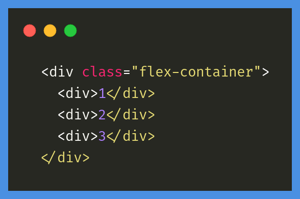

O Flexbox tem como meta ser um modo mais eficiente para criar leiautes, alinhar e distribuir espaços entre itens em um container, mesmo quando as dimensões destes itens são desconhecidas e/ou dinâmicas (daí o termo "flex").

Vamos aprender os fundamentos do CSS Flexbox para alinhamento e posicionamento, e como utilizar suas funcionalidades corretamente.

### O que é o Flexbox

Por muito tempo, as únicas ferramentas disponíveis para criar leiautes em CSS e posicionar elementos com boa compatibilidade entre browsers eram float e position. Porém, essas ferramentas possuem algumas limitações muito frustrantes, especialmente no que diz respeito à responsividade. Algumas tarefas que consideramos básicas em um leiaute, como centralização vertical de um elemento-filho com relação a um elemento-pai ou fazer com que elementos-filhos ocupem a mesma quantidade de espaço, ou colunas terem o mesmo tamanho independente da quantidade de conteúdo interno, eram impossíveis ou muito difíceis de serem manejadas com floats ou position, ao menos de forma prática e flexível.

A ferramenta Flexbox (de Flexible Box) foi criada para tornar essas tarefas mais simples e funcionais: os filhos de um elemento com Flexbox podem se posicionar em qualquer direção e pode ter dimensões flexíveis para se adaptar.

### Elementos

O Flexbox é um módulo completo e não uma única propriedade; algumas delas devem ser declaradas no container (o elemento-pai, que chamamos de flex container), enquanto outras devem ser declaradas nos elementos-filhos (os flex itens).

Se o leiaute "padrão" é baseado nas direções block e inline, o leiaute Flex é baseado em direções "flex flow". Veja abaixo um diagrama da especificação, explicando a ideia central por trás do leiaute Flex.

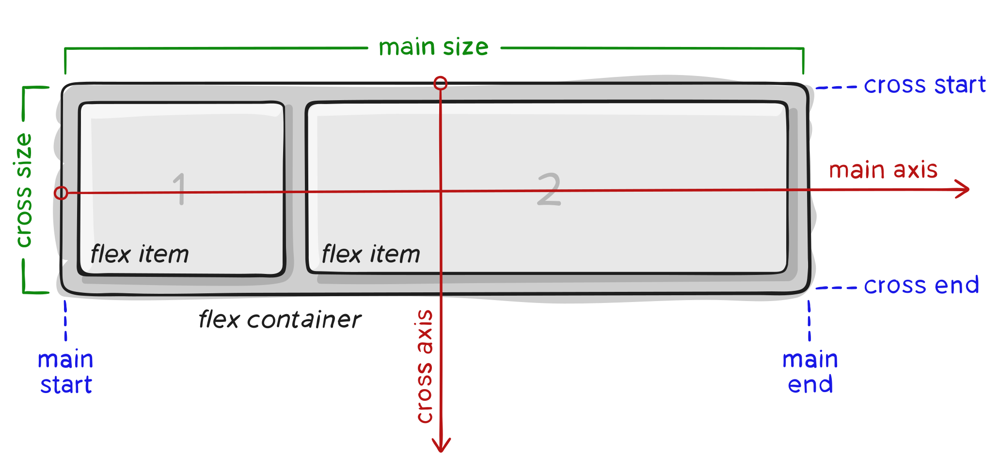

Os ítens serão dispostos no leiaute seguindo ou o eixo principal ou o transversal.

- Eixo principal: o eixo principal de um *flex container* é o eixo primário e ao longo dele são inseridos os *flex items*. **Cuidado**: O eixo principal não é necessariamente horizontal; vai depender da propriedade `flex-direction` (veja abaixo).
- *main-start | main-end*: os *flex items* são inseridos dentro do container começando pelo lado *start*, indo em direção ao lado *end*.
- Tamanho principal: A largura ou altura de um *flex item*, dependendo da direção do container, é o tamanho principal do ítem. A propriedade de tamanho principal de um *flex item* pode ser tanto `width` quanto `height`, dependendo de qual delas estiver na direção principal.
- Eixo transversal: O eixo perpendicular ao eixo principal é chamado de eixo  transversal. Sua direção depende da direção do eixo principal.
- *cross-start | cross-end*: Linhas flex são preenchidas com ítens e adicionadas ao container, começando pelo lado *cross start* do *flex container* em direção ao lado *cross end*.
- *cross size*: A largura ou altura de um *flex item*, dependendo do que estiver na dimensão transversal, é o *cross size* do íten. A propriedade *cross size* pode ser tanto a largura quanto a altura do ítem, o que estiver na transversal.

**Flex container** é o elemento que envolve sua estrutura. Você define que um elemento é um Flex Container com a propriedade `display` e valores `flex` ou `inline-flex`.

```html
  <div class="flex-container">
    <div>1</div>
    <div>2</div>
    <div>3</div>
  </div>
```

```css
  .flex-container {
    display: flex;
  }
```

**Flex Item** são elementos-filhos do flex container.

**Eixos ou Axes** são as duas direções básicas que existem em um Flex Container: *main axis*, ou eixo principal, e *cross axis*, ou eixo transversal.

### Propriedades para o elemento-pai

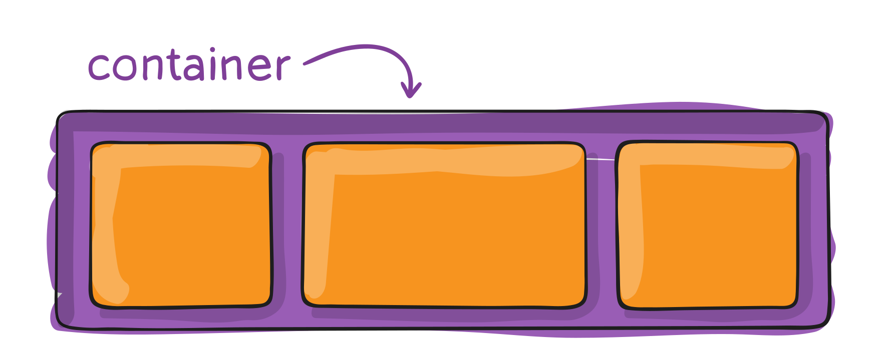

Quando utilizamos o *Flexbox*, é muito importante saber quais propriedades são declaradas no elemento-pai (por exemplo, uma `div` que irá conter os elementos a serem alinhados) e quais serão declaradas nos elementos-filhos. Abaixo, seguem propriedades que devem ser declaradas utilizando o elemento-pai como seletor (para alinhar elementos-filhos):

**display**

Esta propriedade define um *flex container*; inline ou block dependendo dos valores passados. Coloca todos os elementos-filhos diretos num contexto Flex.

```css
.container {
  display: flex; /* or inline-flex */
}
```

Note que a propriedade de CSS `columns` não tem efeito em um *flex container*.

### **flex-direction**

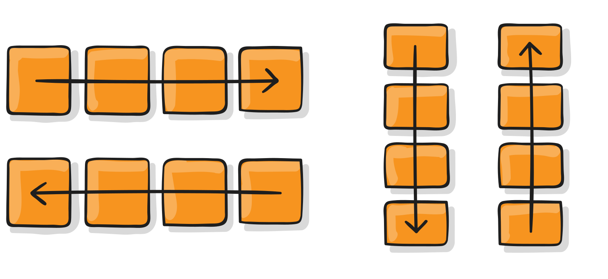

Estabelece o eixo principal, definindo assim a direção em que os *flex items* são alinhados no *flex container*. O Flexbox é (com exceção de um wrapping opcional) um conceito de leiaute de uma só direção. Pense nos *flex items* inicialmente posicionais ou em linhas horizontais ou em colunas verticais.

```css
  .flex-container {
    flex-direction: row | row-reverse | column | column-reverse;
  }
```

- `row` (padrão): esquerda para a direita em `ltr` (left to right), direita para a esquerda em `rtl` (right to left)
- `row-reverse`: direita para a esquerda em `ltr`, esquerda para a direita em `rtl`
- `column`: mesmo que `row`, mas de cima para baixo
- `column-reverse`: mesmo que `row-reverse` mas de baixo para cima

### **flex-wrap**

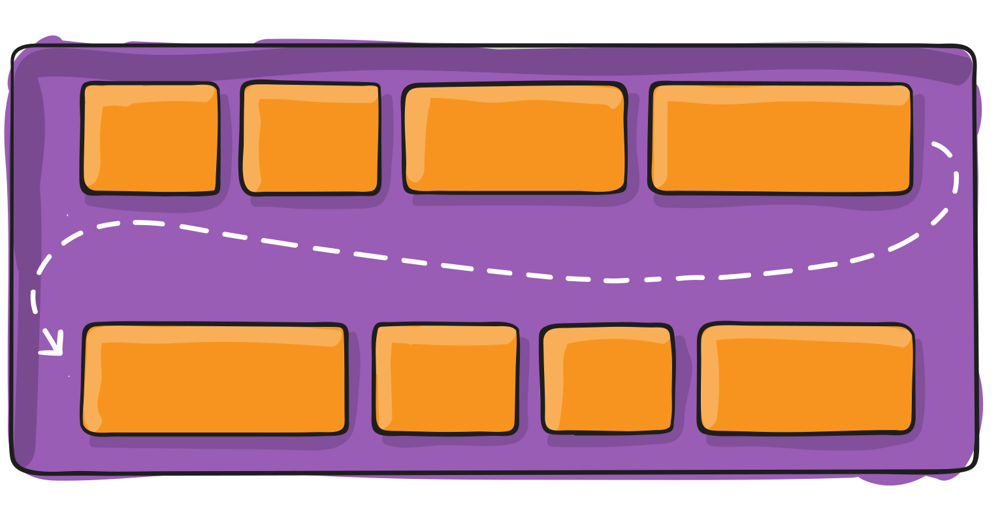

Por padrão, os *flex items* vão todos tentar se encaixar em  uma só linha. Com esta propriedade você pode modificar esse  comportamento e permitir que os ítens quebrem para uma linha seguinte  conforme for necessário.

```css
  .flex-container {
    flex-wrap: nowrap | wrap | wrap-reverse;
  }
```

- `nowrap` (padrão): todos os *flex items* ficarão em uma só linha
- `wrap`: os *flex items* vão quebrar em múltiplas linhas, de cima para baixo
- `wrap-reverse`: os *flex items* vão quebrar em múltiplas linhas de baixo para cima

### **flex-flow**

A propriedade **flex-flow** é uma propriedade *shorthand* (uma mesma declaração inclui vários valores relacionados a mais de uma propriedade) que inclui `flex-direction` e `flex-wrap`. Determina quais serão os eixos pricipal e transversal do container. O valor padrão é `row nowrap`.

```css
  .flex-container {
    flex-flow: row nowrap | row wrap | column nowrap | column wrap;
  }
```

### **justify-content**

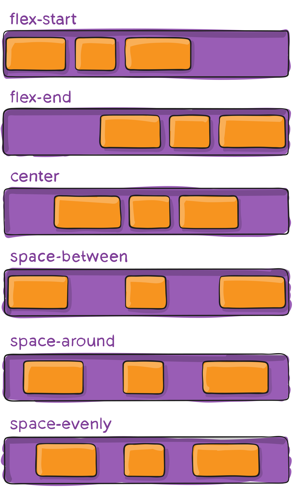

Esta propriedade define o alinhamento dos ítens ao longo do eixo principal.  Ajuda a distribuir o espaço livre que sobrar no container tanto se todos os flex items em uma linha são inflexíveis, ou são flexíveis mas já  atingiram seu tamanho máximo. Também exerce algum controle sobre o  alinhamento de ítens quando eles ultrapassam o limite da linha.

```css
  .flex-container {
    justify-content: flex-start | flex-end | center | space-between | space-around | space-evenly;
  }
```

- `flex-start` (padrão): os ítens são alinhados junto à borda de início (start) de acordo com qual for a `flex-direction` do container.
- `flex-end`: os ítens são alinhados junto à borda final (end) de acordo com qual for a `flex-direction` do container.
- `start`: os ítens são alinhados junto à borda de início da direção do `writing-mode` (modo de escrita).
- `end`: os ítens são alinhados junto à borda final da direção do `writing-mode` (modo de escrita).
- `left`: os ítens são alinhados junto à borda esquerda do container, a não ser que isso não faça sentido com o `flex-direction` que estiver sendo utilizado. Nesse caso, se comporta como `start`.
- `right`: os ítens são alinhados junto à borda direita do container, a não ser que isso não faça sentido com o `flex-direction` que estiver sendo utilizado. Nesse caso, se comporta como `start`.
- `center`: os ítens são centralizados na linha.
- `space-between`: os ítens são distribuídos de forma igual ao longo da linha; o primeiro  ítem junto à borda inicial da linha, o último junto à borda final da  linha.
- `space-around`: os ítens são distribuídos na  linha com o mesmo espaçamento entre eles. Note que, visualmente, o  espaço pode não ser igual, uma vez que todos os ítens tem a mesma  quantidade de espaço dos dois lados: o primeiro item vai ter somente uma unidade de espaço junto à borda do container, mas duas unidades de  espaço entre ele e o próximo ítem, pois o próximo ítem também tem seu  próprio espaçamento que está sendo aplicado.
- `space-evenly`: os ítens são distribuídos de forma que o espaçamento entre quaisquer  dois itens da linha (incluindo entre os ítens e as bordas) seja igual.

Nota: o suporte dado pelos navegadores para estes valores é difuso. Por  exemplo, space-between não tem suporte em nenhuma versão do Edge (até a  elaboração deste tutorial) e start/end/left/right ainda não foram  implementados no Chrome. Para tabelas detalhadas, consulte o MDN. Os  valores mais seguros são flex-start, flex-end e center.

Também existem duas palavras-chave adicionais que você pode usar em conjunto com estes valores: `safe` e `unsafe`. Safe garante que, independente da forma que você faça esse tipo de  posicionamento, não seja possível "empurrar" um elemento e fazer com que ele seja renderizado para fora da tela (por exemplo, acima do topo), de uma forma que faça com que o conteúdo seja impossível de movimentar com a rolagem da tela (o CSS chama isso de "perda de dados").

### **align-items**

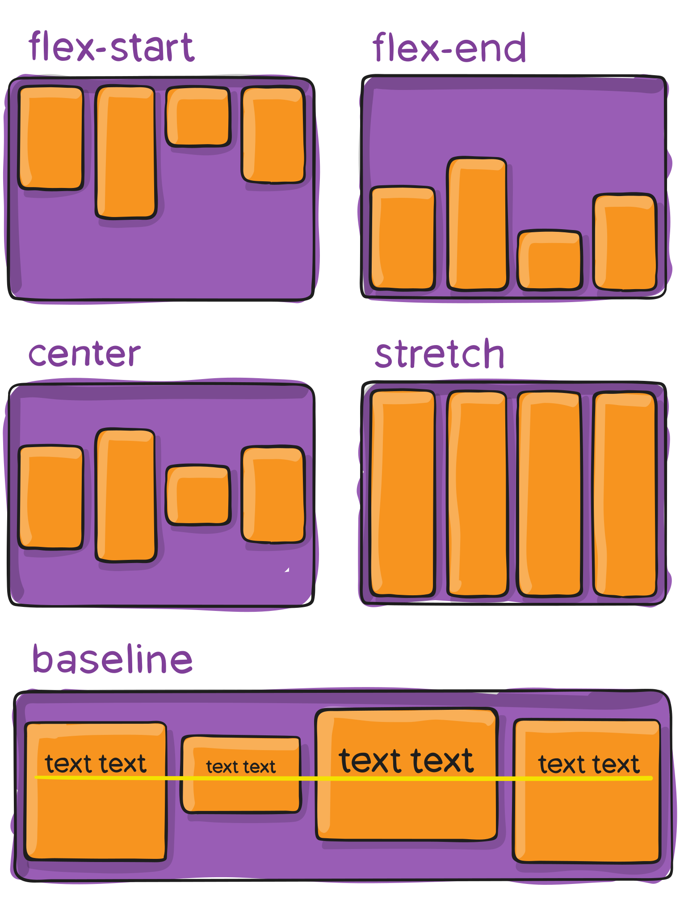

define o comportamento padrão de como *flex items* são alinhados de acordo com o eixo transversal (*cross axis*). De certa forma, funciona de forma similar ao `justify-content`, porém no eixo transversal (perpendicular ao eixo principal).

```css
  .flex-container {
    align-items: stretch | flex-start | flex-end | center | baseline;
  }
```

- `stretch` (padrão): estica os ítens para preencher o container, respeitando o `min-width`/`max-width`).
- `flex-start`/ `start` / `self-start`: ítens são posicionados no início do eixo transversal. A diferença entre eles é sutil e diz respeito às regras de `flex-direction` ou `writing-mode`.
- `center`: ítens são centralizados no eixo transversal.
- `baseline`: ítens são alinhados de acordo com suas baselines.

Os modificadores `safe` e `unsafe` pode ser usados em conjunto com todas essas palavras-chave (favor  conferir o suporte de cada navegador) e servem para prevenir qualquer  alinhamento de elementos que faça com que o conteúdo fique inacessível  (por exemplo, para fora da tela).

### **align-content**

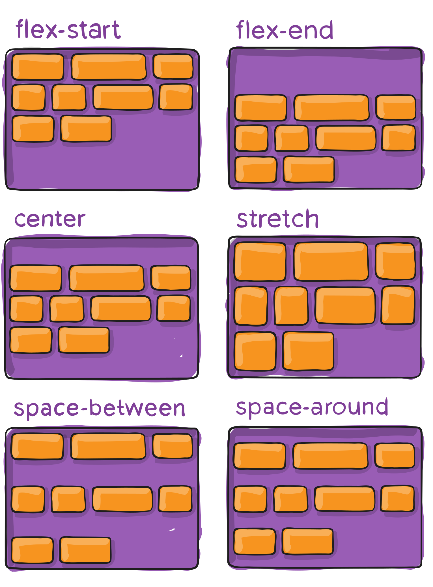

Organiza as linhas dentro de um flex container quando há espaço extra no eixo transversal, similar ao modo como `justify-content` alinha ítens individuais dentro do eixo principal.

**Importante**: Esta propriedade não tem efeito quando há somente uma linha de flex items no container.

```css
  .flex-container {
    align-content: flex-start | flex-end | center | space-between | space-around | stretch;
  }
```

- `flex-start` / `start`:  ítens alinhados com o início do container. O valor (com maior suporte  dos navegadores) flex-start se guia pela flex-direction, enquanto start  se guia pela direção do writing-mode.
- `flex-end` / `end`: ítens alinhados com o final do container. O valor (com maior suporte  dos navegadores) flex-end se guia pela flex-direction, enquanto end se  guia pela direção do writing-mode.
- `center`: ítens centralizados no container.
- `space-between`: ítens distribuídos igualmente; a primeira linha junto ao início do container e a última linha junto ao final do container.
- `space-around`: ítens distribuídos igualmente com o mesmo espaçamento entre cada linha.
- `space-evenly`: ítens distribuídos igualmente com o mesmo espaçamento entre eles.
- `stretch` (padrão): ítens em cada linha esticam para ocupar o espaço remanescente entre elas.

Os modificadores `safe` e `unsafe` pode ser usados em conjunto com todas essas palavras-chave (favor  conferir o suporte de cada navegador) e servem para prevenir qualquer  alinhamento de elementos que faça com que o conteúdo fique inacessível  (por exemplo, para fora da tela).

### Propriedades para elementos-filhos

A seguir, veremos propriedades que devem ser declaradas tendo como seletor os elementos-filhos, ou seja:

```html
  <div class="flex-container">
    <div class="flex-item">1</div>
    <div class="flex-item">2</div>
    <div class="flex-item">3</div>
  </div>
```

Isso significa que, onde existe um elemento-pai com propriedade *flex* (o *flex-container*), é possível atribuir propriedades flex específicas também para as elementos-filhos (*flex-item*).

Você pode definir as propriedades abaixo para apenas um dos elementos-filhos através de um identificador, como uma classe específica.

### **order**

Determina a ordem em que os elementos aparecerão.

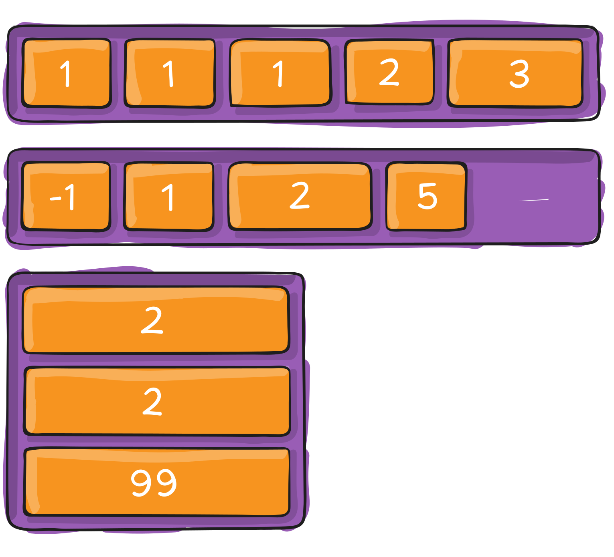

Por padrão os flex items são dispostos na tela na ordem do código. Mas a propriedade `order` controla a ordem em que aparecerão no container.

```css
  .flex-item {
    order: <número>; /* o valor padrão é 0 */
  }
```

### **flex-grow**

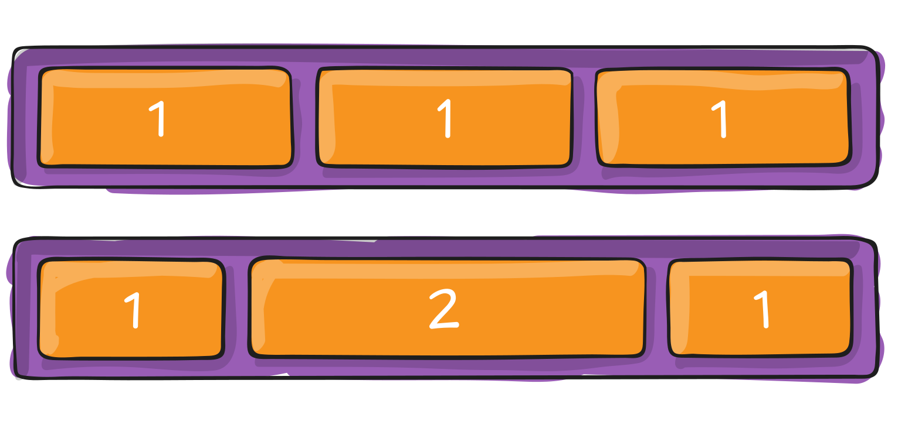

Define a habilidade de um flex item de crescer, caso necessário. O valor dessa propriedade é um valor numérico sem indicação de unidade, que serve  para cálculo de proporção. Este valor dita a quantidade de espaço  disponível no container que será ocupado pelo item.

Se todos os  ítens tiverem flex-grow definido em 1, o espaço remanescente no  container será distribuído de forma igual entre todos. Se um dos ítens  tem o valor de 2, vai ocupar o dobro de espaço no container com relação  aos outros (ou pelo menos vai tentar fazer isso).

```css
  .flex-item {
    flex-grow: <numero>; /* o valor default(padrão) é 0 */
  }
```

Valores negativos não são aceitos pela propriedade.

### **flex-shrink**

Define a habilidade de um flex item de encolher, caso necessário.

```css
  .flex-item {
    flex-shrink: <número>; /* o valor padrão é 0 */
  }
```

Valores negativos não são aceitos pela propriedade.

**flex-basis**

Define o tamanho padrão para um elemento antes que o espaço remanescente do  container seja distribuído. Pode ser um comprimento (por exemplo, 20%,  5rem, etc) ou uma palavra-chave. A palavra-chave `auto` significa "observe minhas propriedades de altura ou largura" (o que era feito pela palavra-chave `main-size`, que foi depreciada). A palavra-chave `content` significa "estabeleça o tamanho com base no conteúdo interno do ítem" - essa palavra-chave ainda não tem muito suporte, então não é fácil de  ser testada, assim como suas relacionadas: `max-content`, `min-content` e `fit-content`.

```css
  .flex-item {
    flex-basis: flex-basis:  | auto; /* o valor padrão é auto */
  }
```

Com o valor de `0`, o espaço extra ao redor do conteúdo não é considerado. Com o valor de `auto`, o espaço extra é distribuído com base no valor de `flex-grow` do ítem.

### **flex**

Esta é a propriedade *shorthand* para `flex-grow`, `flex-shrink` e `flex-basis`, combinadas. O segundo e terceiro parâmetros (`flex-shrink` e `flex-basis`) são opcionais. O padrão é `0 1 auto`, mas se você definir com apenas um número, é equivalente a `0 1`.

```css
  .item {
    flex: none | [ <'flex-grow'> <'flex-shrink'>? || <'flex-basis'> ]
  }
```

**É recomendado que você utilize esta propriedade \*shorthand\*** ao invés de definir cada uma das propriedades em separado. O *shorthand* define os outros valores de forma inteligente.

### **align-self**

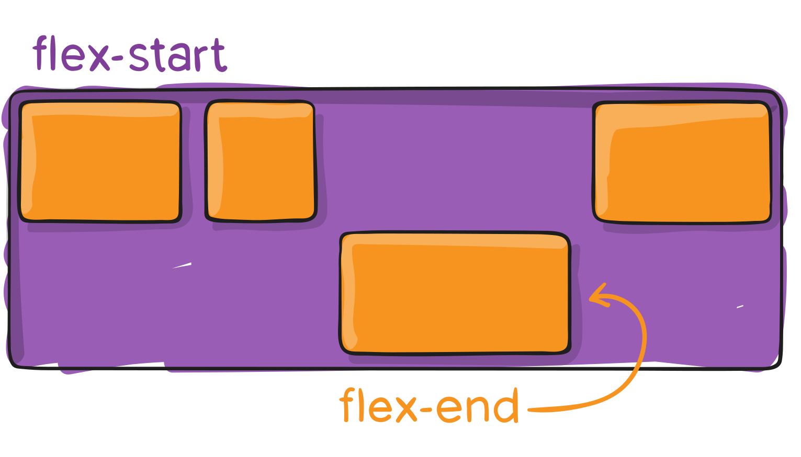

Permite que o alinhamento padrão (ou o que estiver definido por `align-items`) seja sobrescrito para ítens individuais.

Por favor veja a explicação da propriedade `align-items` para entender quais são os possíveis valores.

```css
  .item {
    align-self: auto | flex-start | flex-end | center | baseline | stretch;
  }
```

### Importante!

- O CSS só enxerga a hierarquia pai-filho; não vai aplicar as propriedades Flex para elementos que não estejam diretamente relacionados;
- Para que as propriedades funcionem nos elementos-filhos, as pais devem ter propriedade `display: flex;`.
- As propriedades `float`, `clear` e `vertical-align` não têm efeito em flex-items.

### Juliana Amoasei

| Perfil | Especialização |
| ------------------------------------------------------- | :----------------------------------------------------------- |
|  | ***Juliana Amoasei***<br />Desenvolvedora JavaScript com background multidisciplinar, sempre aprendendo para ensinar e vice-versa. Acredito no potencial do conhecimento como agente de mudança pessoal e social. Atuo como instrutora na Escola de Programação da Alura e, fora da tela preta, me dedico ao Kung Fu e a nerdices em geral. |

<!-- Botões de navegação -->
[](../../README.md#quicksnip "Início")
[](../README.md#quicksnip "Voltar")
[](#quicksnip "Topo")
[](#conteúdo "Conteúdo")
<!-- /Botões de navegação -->

---

## Modelo de CSS Responsivo com Media Queries

Este modelo de CSS pode ser usado para adaptar a estilização de uma aplicação com base nas dimensões da tela. Ele define estilos gerais, bem como estilos específicos para dispositivos menores que 600px e dispositivos maiores ou iguais a 600px.

```css
/* Estilos padrão (Desktop) */
body {
  font-size: 16px;
  margin: 20px;
  background-color: #f5f5f5;
}

/* Estilos para telas menores que 600px */
@media (max-width: 599px) {
  body {
    font-size: 14px;
    margin: 10px;
    background-color: #e0f7fa;
  }

  .container {
    padding: 10px;
  }

  .button {
    width: 100%;
    font-size: 14px;
  }
}

/* Estilos para telas maiores ou iguais a 600px */
@media (min-width: 600px) {
  body {
    font-size: 18px;
    margin: 30px;
    background-color: #fff3e0;
  }

  .container {
    padding: 20px;
  }

  .button {
    width: 200px;
    font-size: 16px;
  }
}
```

### Explicação
1. **Estilos Globais**:
   - Use como base os estilos aplicáveis a todos os dispositivos (Desktop, por exemplo).
2. **`@media (max-width: 599px)`**:
   - Estilos aplicados para telas menores que 600px, como smartphones.
3. **`@media (min-width: 600px)`**:
   - Estilos aplicados para telas maiores ou iguais a 600px, como tablets ou laptops.

### Como Usar
1. **Adicione este CSS no seu projeto**:
   - Inclua-o em um arquivo CSS separado (por exemplo, `responsive.css`) ou dentro de uma tag `<style>` em seu HTML.
2. **Ajuste as classes conforme necessário**:
   - Substitua `.container`, `.button`, e outras classes com as específicas do seu projeto.
3. **Teste em dispositivos diferentes**:
   - Utilize ferramentas de desenvolvedor no navegador (F12) para simular diferentes larguras de tela e verificar os ajustes.

Agora você pode usar este modelo para tornar suas aplicações responsivas de forma eficiente!

<!-- Botões de navegação -->
[](../../README.md#quicksnip "Início")
[](../README.md#quicksnip "Voltar")
[](#quicksnip "Topo")
[](#conteúdo "Conteúdo")
<!-- /Botões de navegação -->

---

## 🔍 Verificando a versão do React e React-DOM em projetos com frontend isolado

Em projetos estruturados com um diretório separado para o frontend (como `/frontend` dentro do projeto principal), você pode verificar a versão instalada do `react` e `react-dom` com os comandos abaixo.

### 🧭 Caminho sugerido do projeto

```
/meu-projeto/
└── frontend/
```

### 📦 Passo a passo

1. Acesse o diretório `frontend` onde o React está instalado:

   ```bash
   cd ./frontend
   ```

2. Verifique a versão do `react` instalada:

   ```bash
   npm list react
   ```

   Exemplo de saída:

   ```bash
   frontend@1.0.0 /caminho/do/projeto/frontend
   └── react@19.1.0
   ```

3. Verifique a versão do `react-dom` instalada:

   ```bash
   npm list react-dom
   ```

   Exemplo de saída:

   ```bash
   frontend@1.0.0 /caminho/do/projeto/frontend
   └── react-dom@19.1.0
   ```

> 💡 Dica: Se o comando retornar `(empty)` ou erro de dependência, certifique-se de estar na pasta correta onde o `package.json` do frontend está localizado.

<!-- Botões de navegação -->
[](../../README.md#quicksnip "Início")
[](../README.md#quicksnip "Voltar")
[](#quicksnip "Topo")
[](#conteúdo "Conteúdo")
<!-- /Botões de navegação -->

---
